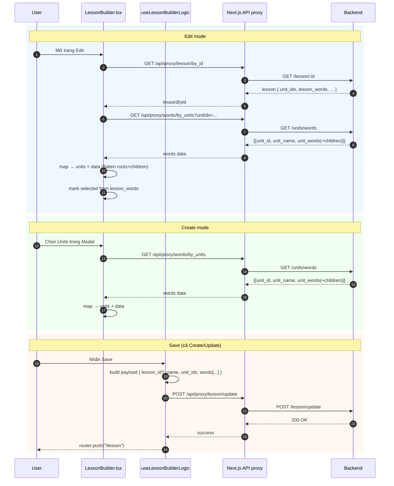

# Tài liệu hệ thống – Trang Quản Lý Giáo Trình

Tài liệu mô tả cấu trúc, dữ liệu và luồng hoạt động của trang quản lý giáo trình (`quanlygiaotrinh/page.tsx`). Mục tiêu là giúp nắm nhanh cách tổ chức UI, state, API và các edge cases để bảo trì và mở rộng.

## 1) Tổng quan
- Hiển thị danh sách giáo trình gốc (carousel 1 hàng, 3 item/trang)
- Hiển thị danh sách bài học được nhóm theo giáo trình (carousel 2 hàng, 3 cột → 6 item/trang)
- Xóa giáo trình/bài học (với xác nhận)
- Điều hướng bằng nút Previous/Next và dot indicators

## 2) Mô hình dữ liệu (UI)

Các interface rút gọn dùng cho UI (có thể khác với dữ liệu thực tế từ API/DB):

```ts
interface Level {
    id: string
    name: string
    description?: string
    units?: Array<{ id: string; name: string; content?: string }>
}

interface Curriculum {
    id: string
    title: string
    description?: string
    levels?: Level[]
    createdAt?: string
}

interface LessonList {
    id: string
    name: string
    id_curriculum: string
    id_level: string
    list_exercise: string[]
}
```

Lưu ý: Ở layer domain có thể có các kiểu đầy đủ hơn (xem `src/lib/types.ts`), nhưng trang này chỉ cần các thuộc tính phục vụ render.

## 3) Trạng thái (State)
- `curriculums: Curriculum[]`: danh sách giáo trình hiển thị ở carousel trên
- `lessonLists: LessonList[]`: danh sách bài học đã tạo, nhóm theo giáo trình
- `isLoading: boolean`: cờ tải dữ liệu ban đầu
- `error: string | null`: thông báo lỗi ngắn gọn (nếu có)
- `carouselIndices: Record<string, number>`: vị trí hiện tại của carousel bài học theo `curriculumId`
- `curriculumCarouselIndex: number`: vị trí hiện tại của carousel giáo trình

## 4) Helpers/Selectors

```ts
// Định dạng dd/mm/yyyy hoặc "Không rõ"
function formatDate(dateString?: string): string

// Tổng số units của một giáo trình

function getTotalUnits(levels?: Levels): number

// Ước tính số từ = units * 10
function getTotalWords(levels?: Levels): number

// Lọc lesson list theo curriculum
function getLessonsBycurriculum(curriculumId: string): LessonList[]

// Tìm tên level trong curriculum
function getLevelName(curriculumId: string, levelId: string): string
```

## 5) UI & Điều hướng

### Curriculum Carousel (trên)
- Bố cục: 1 hàng x 3 cột
- Điều hướng: Previous/Next (ẩn ở đầu/cuối), dot indicators
- `itemsPerPage = 3` → tính chỉ số dựa trên tổng curriculums

### Lesson Lists Carousel (dưới, theo curriculum)
- Bố cục: 2 hàng x 3 cột → 6 item/trang
- Điều hướng: Previous/Next (ẩn ở đầu/cuối), dot indicators
- `carouselIndices[curriculumId]` lưu offset mục tiêu (bội số của 6)

### Hàm điều hướng tiêu biểu
```ts
function getCarouselIndex(curriculumId: string): number
function setCarouselIndex(curriculumId: string, index: number): void

// next cho lesson list
function nextSlide(curriculumId: string, totalItems: number): void

// prev cho lesson list
function prevSlide(curriculumId: string): void

// next cho curriculum
function nextCurriculumSlide(): void
// prev cho curriculum
function prevCurriculumSlide(): void
```

## 6) Tích hợp API

Các endpoint minh họa (đặt tên theo layer Next.js proxy), kiểm tra route thực tế trong `src/app/api` hoặc `server/index.js`:

- Lấy danh sách giáo trình cơ bản: `GET /api/curriculum`
- Lấy chi tiết một giáo trình: `GET /api/curriculum/[id]`
- Lấy danh sách bài học: `GET /api/danhsachtu`
- Xóa bài học: `DELETE /api/danhsachtu?id=<lessonId>`

Mẫu xoá bài học:
```ts
async function deleteLessonList(lessonId: string) {
    if (!confirm('Bạn chắc chắn muốn xóa danh sách này?')) return
    const res = await fetch(`/api/danhsachtu?id=${lessonId}`, { method: 'DELETE' })
    if (!res.ok) throw new Error('Xóa thất bại')
    // Cập nhật state lessonLists tại UI sau khi xóa
}
```

## 7) Luồng hoạt động

### Tải dữ liệu ban đầu
1. Gọi song song danh sách curriculums và lesson lists
2. Với mỗi curriculum cần chi tiết → gọi tiếp `/api/curriculum/[id]` (nếu cần)
3. Chuẩn hóa dữ liệu về model UI
4. Set `curriculums`, `lessonLists`, tắt `isLoading`
5. Nếu lỗi: set `error` và hiển thị fallback phù hợp

### Xoá
1. Hiện confirm
2. Gọi API `DELETE`
3. Nếu thành công: cập nhật state tương ứng (lọc bỏ item)
4. Nếu thất bại: hiển thị lỗi và không đổi state

## 8) Edge cases & Xử lý lỗi
- Không có curriculum/lesson list: hiển thị empty state thân thiện
- Lỗi API: hiển thị message ngắn + nút thử lại (nếu phù hợp)
- Dữ liệu thiếu trường: dùng giá trị mặc định (ví dụ ngày tạo, mô tả)
- Carousel khi số item < itemsPerPage: ẩn nút điều hướng/dots

## 9) Responsive
- Mobile: 1 cột
- Tablet: 2 cột
- Desktop: 3 cột
- Sử dụng Tailwind breakpoints để linh hoạt layout

## 10) Ghi chú bảo trì
- Giữ model UI tách biệt với model domain (nếu API thay đổi)
- Đặt helper chuẩn hóa dữ liệu riêng (mapping từ API → UI)
- Bao bọc API calls bằng try/catch và phân loại lỗi (network, validate)
- Tối ưu re-render carousel bằng memo hóa danh sách và chỉ số

## 11) Checklist kiểm thử nhanh
- [ ] Tải dữ liệu ban đầu thành công và hiển thị đúng
- [ ] Carousel curriculum: nút/dots hoạt động, ẩn đúng lúc
- [ ] Carousel lesson lists: phân trang 6 item, điều hướng đúng
- [ ] Xoá bài học: confirm → xóa → cập nhật UI
- [ ] Empty/error states hiển thị hợp lý
- [ ] Responsive tốt ở 3 breakpoint chính
- `totalItems`: Tổng số items trong danh sách

## Sơ đồ kiến trúc

### 1) Kiến trúc thành phần (Lesson Builder)

```mermaid
flowchart LR
  subgraph UI [Next.js Client]
    LB[LessonBuilder.tsx]
    WSP[WordSelectionPanel.tsx]
    SWP[SelectedWordsPanel.tsx]
    LBL[useLessonBuilderLogic.ts]
  end

  subgraph State [Client State]
    ST1[data: Record<unit_id, LocalWord[]>]
    ST2[lessonWords: LessonWord[]]
    ST3[units: Unit[]]
    ST4[selectedUnitIds: string[]]
    ST5[courseName: string]
  end

  subgraph API [Next.js API proxy]
    API1[/GET /api/proxy/words/by_units/]
    API2[/POST /api/proxy/lesson/update/]
    API3[/GET /api/proxy/lesson/by_id/]
  end

  LB --> LBL
  LB --> WSP
  LB --> SWP

  LBL <--> ST1
  LBL <--> ST2
  LB  <--> ST3
  LB  <--> ST4
  LB  <--> ST5
  WSP <--> ST1
  SWP <--> ST2

  LBL --> API2
  LB  --> API1
  LB  --> API3
```

### 2) Luồng Create/Update



Gợi ý preview:
- VS Code: Ctrl+Shift+V để xem Markdown preview. Nếu không thấy diagram, cài “Markdown Preview Mermaid Support”.
